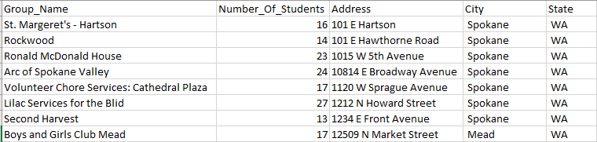
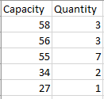

# BusPackingAlgorithm
Authors: Nathan Atchison & Isaac Teo <br/>
Class: CS 473 - Algorithm Analysis and Design <br/>
Last Modified: 12/12/2023 <br/>

## Goals:
* Create an efficient way of packing the buses for Community Building Day (CBD)
* Ensure that there is less manual work that needs to be done in prepartion for CBD
* Have an algorithm that takes minimal time to run
* Outputs are easy to understand for the user
* Ease of distribution and use (user only needs access to the executable)

## Algorithmic Approach:
1. We started with how to cluster the groups by distance from randomly generated points (k-means clustering).
2. After clustering, we then did a first pass on packing buses within clusters.
    * At first, we were packing based on time difference between the first and last bus.
    * After more discussion and testing with packing, it became evident that filling as many buses as possible was a higher priority.
3. After the first pass, we ran optimizations by repeating the first two steps with only the groups that weren't packed into buses (Repeats 100 times)
4. After we optimized, we checked if this test case had more buses used that previous test cases. If so, we say that this is the most efficient test case so far.
5. Repeat step 1-4 100 times to get different test cases.
6. Take the most efficient test case and output its results to output files

## How to Run Program

### How to get Executable:
1. Clone this repository and open in VS Code
2. In a new terminal, run the following command:
    <br/>`pyinstaller --onefile main.py`
3. Executable can be found in the following directory: `dist/`

### Setting up Files:
**NOTE:** User must have two .csv files to be used for this program
* GroupData (**case sensitive**): Contains all data about each individual group including their name, size, and destination address
* BusData(**case sensitive**): Contains how many buses of each size are being used.
* Additional data not mentioned below may be included in the .csv files. However, it won't have any effect on the outputs of the file.

#### Formatting Data Files
* GroupData (See below for example):
  * Columns that must be included (**case sensitive**): Group_Name, Number_Of_Students, Address, City, State
  * **Address must be as it appears on Google** (i.e, 101 <ins>1st</ins> street is not that same at 101 <ins>First</ins> street). Failure to do so will result in the location api not being able to find this address and the entire program breaking.
* BusData (See below for example):
  * Columns that must be included (**case sensitive**): Capacity, Quantity

**Group Data** <br/>
 <br/>
**Bus Data** <br/>
 <br/>


### Running the Executable:
* Move BusData.csv and GroupData.csv into the `dist/` directory
* In file explorer, open `main.exe`
* Terminal will automatically close when program is finished
* Ouput files can be found in the `outputfiles/` directory

## Assumptions of Project

### Assumptions about Programmer
* Programmer is using a version of Python between 3.10 and 3.12
* Programmer has the following packages installed:
    * geopy
    * pyinstaller
    * numpy

### Assumptions about User
* User will have to handle accessibility needs on their own basis
* User will have formatted the data correctly as defined above in `Setting up Files`

### Other Assumptions
* Given the constraints of the problem, efficiency in the case of bus packing is defined as filling as many buses as possible to maximum capacity, with a secondary priority of clustering groups based on relative distance to each other.
* This algorithm does not completely pack every single bus. The user of this algorithm must do some manual work to handle remaining groups and buses.

## Pseudo Code
K-Means
```
//Putting groups into clusters based on means
//Inputs: Dictionary longLatDict containing all group longitudes and latitudes
          Integer numBuses equal to the number of buses available
//Ouputs: Dictionary of lists clusters containing the clustered groups
means <- []
for i <- to numBuses do
    xPt <- 2*random float from -1 to 1
    yPt <- 2*random float from -1 to 1
    append [i, xPt, yPt] to means
clusters <- dictionary of lists
prevClusters <- dict[0]

while prevClusters != clusters do
    prevClusters <- clusters
    for each group in longLatDict do
        groupLong <- longLatDict[group][longitude]
        groupLat <- longLatDict[group][latitude]
        minDist <- INFINITY
        closestCluster <- 0
        for each mean in means do
            xDiff <- (groupLong - mean xPt)^2
            xDiff <- (groupLat - mean yPt)^2
            dist <- sqrt(xDiff + yDiff)
            if dist < minDist do
                minDist <- dist
                closestCluster <- mean index
        usedGroup <- false
        
        for each cluster in clusters do
            if group exists in cluster do
                usedGroup <- true
                break
        if usedGroup = false do
            append group to clusters[closestCluster]

    for each cluster in clusters do
        xSum, ySum <- 0
        for each group in cluster do
            xSum <- xSum + longLatDict[group][longitude]
            ySum <- ySum + longLatDict[group][latitude]
        means[cluster] xPt <- xSum/cluster length
        means[cluster] yPt <- ySum/cluster length
    
    return clusters
```
Packing
```
//Implements a packing algorithm for an inputed collection of clusters
//Inputs: Dictionary clusters containing all clusters created through K-means
          Dictionary groupSizes containing all data about groups sizes in our clusters
          Dictionary busData containing all data about what buses are available
//Outputs: Dictionary clusters containing all groups not packed to a bus and
           Dictionary busData containing all buses that weren't used
           Dictionary busGroupings containing all pairings who were assigned a bus and what size bus they were assigned
sortedBusData <- sort bus sizes in descending order
busGroupings <- dictionary of lists

for each cluster in clusters do
    for each group in cluster do
        for each busSize in sortedBusData do
            if groupSizes[group] = busSize and busData[busSize] > 0 do
                if busGroupings[busSize] is defined do
                    append group to busGroupings[busSize]
                else do
                    busGroupings[busSize] <- group
                busData[busSize] <- busData[busSize] - 1
                remove group from cluster
                break

    for each busSize in busData do
        find all exclusive pairs that can fill a bus of busSize
    
    for each busSize in busData do
        find all exclusive triplets that can fill a bus of busSize
    
return clusters, busData, busGroupings
```

Bus Packing
```
//Packing as many buses as possible with groups
//Inputs: Dictionary groupSizes containing all Group Sizes and
          Dictionary locData containing all data about Group Destinations
          File BusData.csv containing data about all possible buses
//Outputs: Three .csv files containing the unpacked groups, the remaining unused buses, and all the packed groups

for i <- 1 to 100 do
    busData <- Data collected from the BusData.csv
    
    initClusters <- Clusters created through the K-means algorithm
    remGroups, remBuses, busGroups <- Packing algorithm that assigns groups to buses
    for j <- 1 to 100 do
        remGroupsData <- location data from the groups not packed
        newClusters <- Clusters created through K-means with remaining groups
        newRemGroups, newRemBuses, newBusGroups <- Packing with remaining groups
        remGroups <- newRemGroups
        remBuses <- newRemBuses
        append newBusGroups to busGroups
    
    if numBusesLeft < minimumBusesLeft
        results <- remGroups, remBuses, busGroups
        minimumBusesLeft <- numBusesLeft

Write output to output files
        
```

## Algorithmic Analysis

### Worst Case Analysis
N = number of groups<br/>
M = number of buses<br/>
P = number of bus sizes<br/>
Basic operation: appending to a dictionary<br/>
Number of basic operations per iteration: 1<br/>
Worst case analysis comes from our packing portion of the algorithm where we iterate through every cluster (which is equal to the number of buses), each bus size, and finally each group to find groupings to pack into buses<br/>
Worst Case Analysis: `O(N*M*P)`

### Comparison of Analytical Runtime vs. Empirical Runtime
Measured Empirical Runtimes:

T(N) = (2.4996414184570312 + 2.5283899307250977 + 2.464766025543213) / 3 = 2.4975991249084473<br/>
T(2N) = (2.4626009464263916 + 2.5370981693267822 + 2.5305604934692383) / 3 = 2.5100865364074707<br/>
T(2N) / T(N) = 2.5100865364074707 / 2.4975991249084473 = 1.0049997661251908

Through Empirical Analysis, we get a runtime for our algorithm of `O(N)`

Compared to our Worst Case Analysis, which was `O(N*M*P)`, our empirical analysis gave us a significantly better runtime. This makes sense as in the real world data where this code would be run, P and M would be signficantly smaller than N. This also makes sense as this program works with extremely small data sets, and thus there is minimal change in runtime.


## References
* https://geopy.readthedocs.io/en/stable/
* https://en.wikipedia.org/wiki/K-means_clustering
* https://www.geeksforgeeks.org/writing-csv-files-in-python/
* https://whitgit.whitworth.edu/2023/fall/CS-473-1/Group_Projects/project-resources/bus-routing
* https://numpy.org/
* https://pyinstaller.org/en/stable/
* https://stackoverflow.com/questions/7370801/how-do-i-measure-elapsed-time-in-python
* https://medium.com/@hazallgultekin/convert-address-to-latitude-longitude-using-python-21844da3d032
